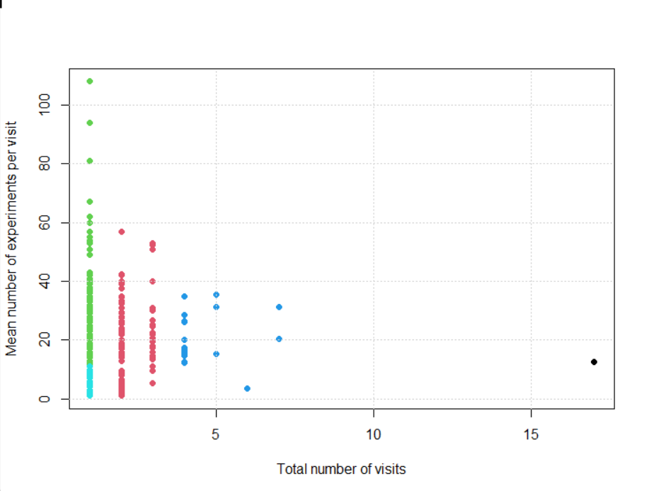
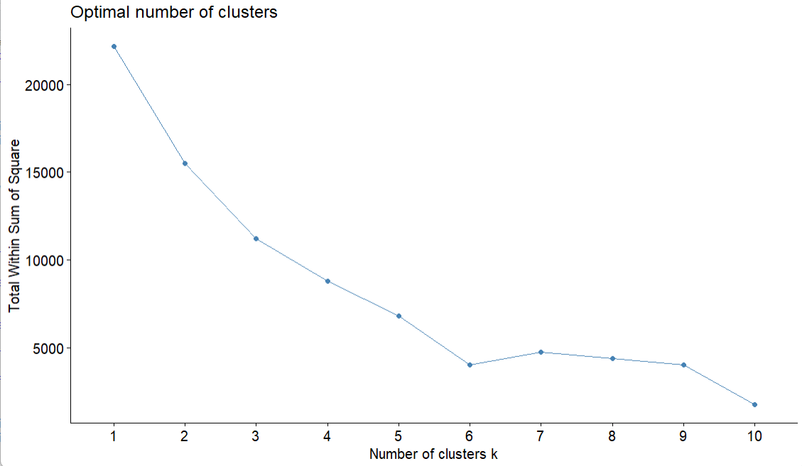
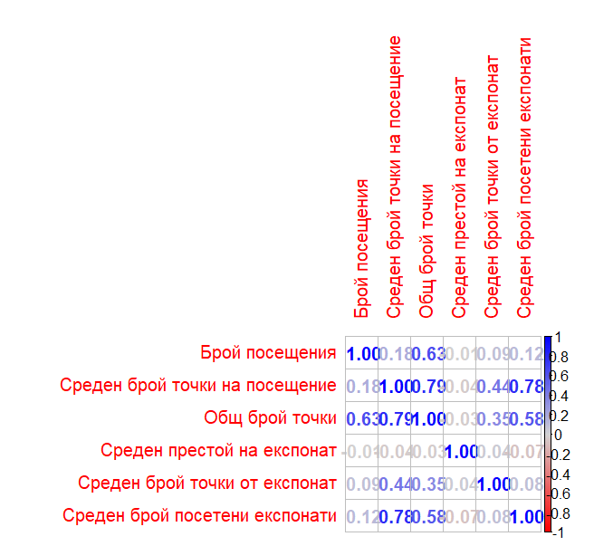

# 🧠 tml-visitor-behavior-analysis

A case study in data preprocessing and behavioral analysis of real visitor interactions from **TechnoMagicLand (TML)**.  
The project leverages clustering, correlation, and statistical visualization in **R** to uncover key usage patterns and optimize user engagement.

---

## 🧾 Project Scope

This project follows a full **CRISP-DM** cycle for behavior-driven analytics based on museum interaction logs.

### 🧪 Key Objectives:
- Clean and prepare real-world visitor data
- Identify high-value vs casual users
- Understand exhibit engagement patterns
- Cluster users based on time, visits, and interaction profiles
- Visualize behavioral and statistical relationships

📄 You can explore the full technical write-up here:  
➡️ [TML Behavioral Analysis Report (PDF)](./98919ec4-dbf2-4435-a7d6-193cdc55c384.pdf)

🧮 Code execution is available in the R script:  
➡️ [all-tables-preprocessed_final_1.R](./all-tables-preprocessed_final_1_R)

---

## 🧰 Tools & Technologies

- **Language**: `R`
- **Libraries**: `dplyr`, `ggplot2`, `tidyr`, `cluster`, `factoextra`, `corrplot`
- **Clustering**: `k-means` with elbow method
- **Visualization**: Histograms, scatter plots, boxplots, heatmaps
- **Data source**: Interaction logs from TechnoMagicLand

---

## 📊 Visual Outputs

Key insights were visualized across multiple analytical dimensions:

| Graphic | Description |
|--------|-------------|
|  | Distribution of visitor points with outliers |
|  | Clustering based on visits vs experiments |
|  | Optimal number of clusters via elbow method |
|  | Correlation between behavioral metrics |
|  | Exhibit difficulty index |
|  | Highest scoring visitors |

_(Full visual list available in the repo.)_

---

## 🔍 Key Findings

- 🧍‍♂️ Most visitors only visit once, but some accumulate many points
- 🧠 High repeat users tend to interact with more exhibits on average
- 🎯 Certain exhibits have consistently high interaction time but low scores, indicating high difficulty or engagement
- 📉 Many visitors drop off after only 1–2 interactions
- 🤖 Clustering identified meaningful segments (e.g. speedrunners vs explorers)

---

## 📁 Repository Structure

📦 tml-visitor-behavior-analysis
├── 📊 PNG visualizations
├── 📄 all-tables-preprocessed_final_1.R
├── 📘 README.md
├── 📑 LICENSE (MIT)
├── 📕 Report PDF (Technical Summary)

---

## 🧠 Topics

`r`, `clustering`, `data-preprocessing`, `data-visualization`,  
`visitor-behavior`, `user-segmentation`, `education-project`, `technomagicland`

---

## 📜 License

This project is licensed under the **MIT License** – see [LICENSE](./LICENSE) for details.

---

## 🙌 Credits

Conducted as part of a data science and education analytics project based on real museum interaction data.  
Developed by [Sergey Filipov](https://github.com/SergeyFilipov)

